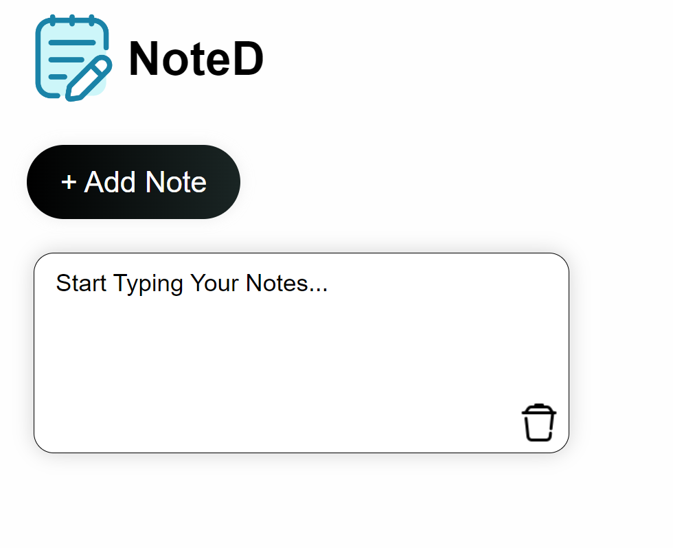

# Notes App

A simple and efficient Notes App that allows users to create and delete notes. This project is built using **HTML**, **CSS**, and **JavaScript**, providing a straightforward way to keep track of ideas, to-do lists, or any other information.

## Features

- **Create Notes**: Add new notes with a click of a button.
- **Delete Notes**: Remove individual notes when they are no longer needed.
- **Persistent Storage**: (Future enhancement) Save notes to local storage to keep them even after refreshing the page.
- **Responsive Design**: Works well on all screen sizes, making it easy to use on mobile devices and desktops.

## Demo

Check out the live demo of the project [here](https://sanskargupta0.github.io/Notes-App/).




## Installation and Setup

1. Clone the repository or download the source code:
    ```bash
    git clone https://github.com/Sanskargupta0/Notes-App.git
    ```

2. Navigate to the project folder:
    ```bash
    cd notes-app
    ```

3. Open `index.html` in your web browser:
    ```bash
    open index.html
    ```

## Usage

1. **Add a Note**: Type your note in the input field and click the "Add Note" button.
2. **View Notes**: Your notes will be displayed on the same page.
3. **Delete a Note**: Click the "Delete" button next to the note you want to remove.


